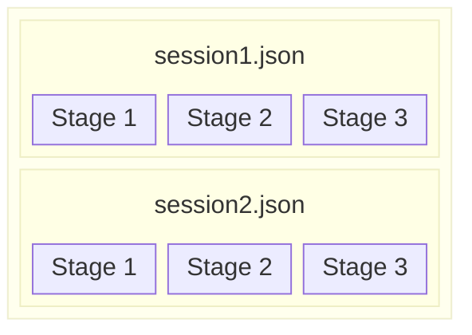

## Core concepts

This page will introduce the core concepts you'll encounter when using _eidon_.

### Experiment

Every **experiment** is a folder with a specific file structure. The folder includes all the materials required to build and run the experiment, including stimuli, configuration files, collected data, and custom code files. For example, it could look like this:

```
📂 my_experiment
├─ config.yaml
├─ experiment.json
├─ 📂 materials
│  └─ 📄 texts.txt
├─ 📂 stimuli
│  ├─ 📄 image1.png
│  ├─ 📄 image1.aois.csv
│  └─ 📄 sound1.wav
├─ 📂 sessions
│  ├─ 📄 subject1.json
│  ├─ 📄 subject2.json
│  └─ 📄 subject3.json
├─ 📂 recordings
└─ 📂 code
   └─ 📄 custom.py
```

Don't worry – you won't have to create all those files yourself. Most of the files will be created automatically by _eidon_. The fact that all these files are contained within a single folder will make it easy for you to share or publish your experiment. Simply zip your experiment and upload it, and anyone will be able to reproduce your experiment.

### Experiment type

_eidon_ supports various **types of experiments** out of the box. For example, a reading experiment with a Latin square design. The experiment type determines what kinds of materials you will need to build an experiment (e.g., texts and comprehension questions) and what the rough procedure will be when you run it (e.g., how the stimuli will be presented).

You can find an overview of all the experiment types that are currently supported [here](experiment-types/index.md). If none of the pre-implemented ones match your needs, you can always [create your own experiment type](experiment-types/custom.md).

### Experiment session

A **session** is a single run of your experiment. It defines precisely what trials are presented in what order, during which parts eye movements are recorded, and what interactions (key presses, etc.) are possible. All of this is defined in a JSON file in the experiment folder. In a typical single-session experiment, there will be one of these session files for each participant. If you are using one of the existing [experiment types](experiment-types/index.md), _eidon_ will generate them for you. But if you want to have full control over every detail in your experiment, you are free to create or generate these session files yourself.

### Experiment stage

Each session consists of a sequence of **stages**. A stage is typically just a single screen where a stimulus is displayed or some interaction happens (e.g., answering a question, performing calibration, etc.). If you are using one of the existing [experiment types](experiment-types/index.md), you will not have to configure these stages yourself.


