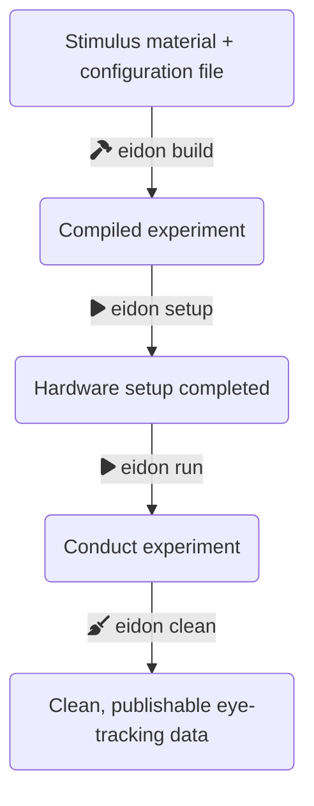

_eidon_ is a toolkit for implementing eye-tracking experiments and turning the collected data into publication-ready datasets.

You can use it to ...

- ... get started quickly with running your **first eye-tracking study**
- ... implement **common experimental paradigms** (like reading or visual world) without any programming
- ... conduct studies in a **reproducible** way with open and FAIR data principles in mind

_eidon_ is designed to be both **easy to use** and **easy to customize**, depending on your needs and level of expertise. It prioritizes **interoperability**, so you can combine it with the tools you already use and love.

> While _eidon_ is usable and has been used successfully [in several projects](projects.md), it is still under development. This means that some features may be missing, and other features may improve in the future. You can help us out by [creating feature requests or bug reports](https://github.com/saeub/eidon/issues), or by [contributing code](https://github.com/saeub/eidon/pulls)!

## Who is _eidon_ for?

_eidon_ is for researchers who use in-lab eye-tracking methods, in particular:

- **Language researchers:** _eidon_ provides implementations for a range of [experiment types](experiment-types/index.md) common in psycholinguistics. These implementations are easy to configure and modify with custom code to suit your needs.
- **NLP researchers:** Want to collect eye-tracking data for your dataset, or see what your annotators are paying attention to? _eidon_ is for you.
- **Students:** If you are just getting started with eye tracking, _eidon_ makes it easy for you to [implement your first experiment](getting-started.md) while following best practices. No coding required.

## Who is _eidon_ **not** for?

_eidon_ is **not** the best choice for you if you want to ...

- ... run **crowdsourcing studies**: _eidon_ is designed for use in a laboratory with high-precision eye trackers (not webcams).
- ... conduct user studies for your **software product or website**: all stimuli need to be rendered by _eidon_ itself, not via an external program.
- ... run an experiment with an eye tracker other than **SR Research EyeLink**: _eidon_ currently only supports EyeLink. If you have a different brand of eye tracker and would like to help us support it, please [get in touch](contact.md)!

## How _eidon_ works

_eidon_ consists of several components:

- **`eidon build`** builds your experiment. You provide the stimuli and configure fonts, colors, participant numbers, and other settings, and `eidon build` will turn it into a presentable experiment.
- **`eidon run`** runs your experiment. Simply provide the session ID, and `eidon run` will present the stimuli, handle participant interaction, and record eye-tracking data.
- **`eidon clean`** helps you inspect and clean your eye-tracking data.

## [➡️ Getting started](getting-started.md)

## Documentation

- [Best practices](best-practices.md)
- [Core concepts](core-concepts.md)
- [Command-line interface](cli/index.md)
- [Experiment types](experiment-types/index.md)
- [Experiment stages](experiment-stages/index.md)

## [➡️ Projects using _eidon_](projects.md)
